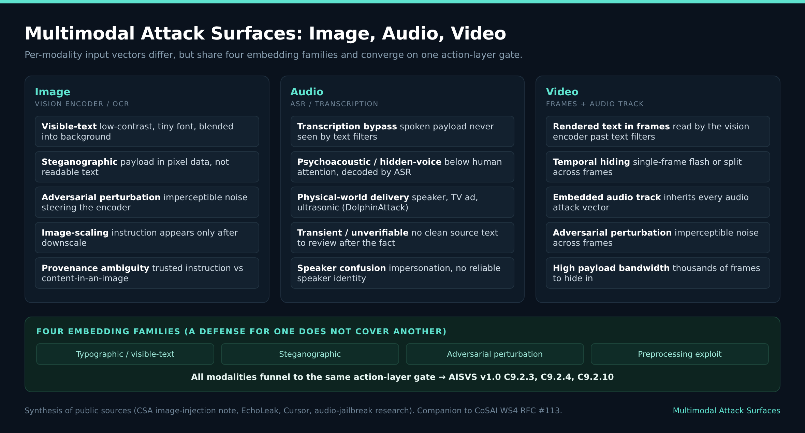
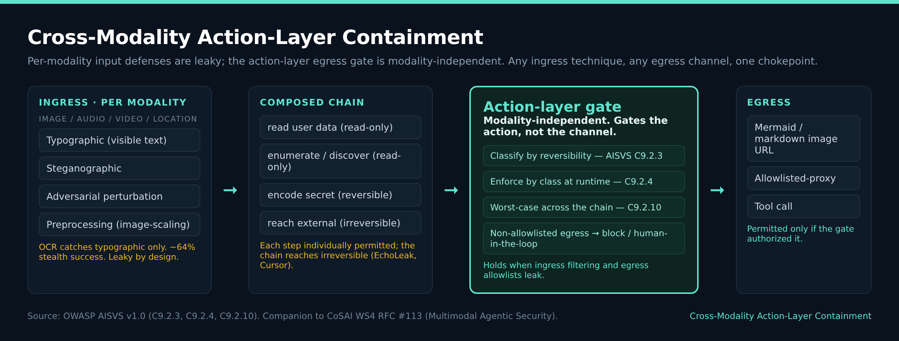

# Cross-Modality Action-Layer Containment

**A Verification-Side Contribution to Multimodal Agentic Security**

Author: Mayur Agnihotri
Status: Contribution / companion to CoSAI WS4 [RFC] Multimodal Agentic Security (#113, Shriti Priya)
Version: draft, 2026-06-25

## Status of This Document

This document specifies the modality-independent action-layer section intended as a contribution to the CoSAI WS4 RFC on Multimodal Agentic Security (#113). It is a companion to that work's per-modality input defenses, not a standalone standard and not a replacement for the RFC. OWASP AISVS controls are cited at their released v1.0 numbers (C9 Orchestration and Agentic Security chapter). Where this document references CSA NHI chain-audit work, that work is a v2.0-targeted joint contribution under CSA IAM Working Group review.

## Abstract

Agentic AI security has so far concentrated on text: prompt injection in typed input and the text-layer guardrails built to catch it. Production agents now perceive and act across images, video, audio, and location data, and each modality opens an attack surface that text defenses do not see. This document examines those surfaces and the layered defenses they require, and specifies the layer that holds when an input defense fails: the action layer, which is the same regardless of which modality carried the injection. The defense rests on three modality-agnostic primitives: action-class gating by reversibility (AISVS v1.0 C9.2.3, C9.2.4), the worst-case chain rule for composed multi-step chains (C9.2.10), and chain-level audit for attribution. The document closes with a cross-mapping to OWASP, CSA, NIST, and MITRE ATLAS that shows the worst-case-chain control is the single normative anchor for the composition case across these bodies.

## 1. Introduction

Per-modality input defenses decode, scan, and harden each modality before the model reads it. They are necessary and never complete, because every new modality opens a channel the input scanners were not built to inspect, and the strongest documented attacks succeed by entering through the modality whose coverage is weakest. This document specifies the action layer, the part of the system that bounds what an agent may do once an injection has succeeded, independent of which modality carried it.

## 2. Terminology

- **Action class**: a classification of an action by how it can be reversed: read-only, reversible, external-reversible, or irreversible.
- **Trusted classification**: a classification declared at design time and evaluated by the gate, not derived from the agent's runtime reasoning.
- **Worst-case chain rule**: a composed multi-step or multi-agent chain is gated by the highest-impact action class present anywhere in the chain.
- **Ingress**: how a malicious instruction enters through a modality.
- **Egress**: how data leaves after an injection succeeds.
- **Action-layer gate**: the deterministic enforcement point that evaluates an action's class and the chain's worst case before execution.

## 3. Attack Taxonomy

*Figure 2. Multimodal Attack Surfaces (image / audio / video).*

The attack is the product of two independent choices. Filtering one ingress family or patching one egress channel leaves every other combination open.

### 3.1 Embedding technique (ingress)
| Technique | How it hides | Catches it / what does not |
|---|---|---|
| Typographic | readable text in pixels (low-contrast, tiny font, blended) | OCR catches; the human reviewer misses |
| Steganographic | payload in pixel/sample data, not visible text | steganalysis; OCR misses |
| Adversarial perturbation | gradient-crafted noise on the encoder, no readable text | input transformation; OCR misses |
| Preprocessing exploit | payload appears only after downscale/transcode | scan the processed artifact; full-resolution scan misses |

The CSA research note (arXiv 2603.03637) reports up to 64 percent attack success under stealth constraints, so ingress filtering is leaky by design.

### 3.2 Exfiltration channel (egress)
Auto-fetched remote image (Cursor CVE-2025-54132, EchoLeak); allowlisted-proxy egress (EchoLeak Teams URL, the wildcard-azure-net bypass); tool-call egress; reference-style markdown / link-redaction bypass.

## 4. Defense Taxonomy

| Layer | Controls | Catches | Leaks |
|---|---|---|---|
| 1. Ingress filtering | decode-then-scan (OCR/transcribe); steganalysis; input transformation; scan the processed artifact; query-aware sanitized descriptions | the technique each is tuned for | no single filter covers all four families; 64 percent stealth success |
| 2. Model-side | alignment/RL to ignore embedded instructions; modality-aware guard models | many cases | guard models inherit the same injection surface they screen |
| 3. Egress control | strip remote images before render; egress allowlist; CSP; output secret/PII scan | the specific channel patched | whack-a-mole; allowlists break on broad domains |
| 4. Action-layer floor (modality-independent) | action-class gating; worst-case chain gate; chain-level audit; HITL for non-allowlisted egress | any ingress times any egress | requires design-time action-class declaration |

## 5. Cross-Modality Action-Layer Containment

*Figure 1. Cross-Modality Action-Layer Containment.*

### 5.1 Attack motivation
The harm does not land in the modality. It lands at the tool layer, through a chain. An injection enters through one modality, and the agent composes individually permitted tool calls into an irreversible outcome. EchoLeak is the canonical multimodal instance: a crafted email coerces the agent, an auto-fetched markdown image provides the egress channel, and the composed chain exfiltrates sensitive context through an allowlisted URL, each step passing its own authorization. The structural property is that authorization is evaluated per step while the danger is a property of the composition. The same gap appears outside multimodal entirely: a coding agent chaining four legitimate operations into a system-irreversible write, each operation permitted by the tool authority.

### 5.2 Defense
Because the harm is at the action layer, the containment belongs there, and it does not need to know the modality. Three primitives:
1. **Action-class gating.** Classify each action by reversibility, declared at design time and trusted by the gate, and enforce by that class at execution (AISVS v1.0 C9.2.3 and C9.2.4). Because the class is set at design time and the agent cannot rewrite it, an injection that corrupts the agent's reasoning through any modality cannot relabel the action to clear its own gate.
2. **Worst-case chain rule.** Gate a composed multi-step or multi-agent chain on the highest-impact reversibility class anywhere in it (AISVS v1.0 C9.2.10), so a chain that composes low-risk steps across modalities into an irreversible end fails the gate at chain start.
3. **Chain-level audit.** Carry a record that makes a multimodal-to-tool exfiltration attributable to a real originating principal: chain id, declared worst-case class at chain start, gate decision and justification, per-step API record, originating principal, and immutability of the originating principal. This six-property schema is a joint peer-review contribution with Mallikarjunarao Sunke, under CSA IAM Working Group review.

## 6. Standards Cross-Mapping

| Concern (attack to defense) | OWASP | CSA | NIST | MITRE ATLAS |
|---|---|---|---|---|
| Multimodal prompt injection | LLM01; AISVS C2 | Image-Based Prompt Injection note; AICM TVM | AI RMF GenAI Profile; SP 800-53 SI-10 | AML.T0051 |
| Cross-modality composition / chained exfil | LLM06 + LLM02; AISVS C9.2.10 | Agentic Trust Framework | SP 800-53 AC-3 / AC-4 | exfiltration tactic |
| Agent self-classification | AISVS C9.2.3 | Agentic Trust Framework | AI RMF MAP/MEASURE | AML.T0099 |
| Action gating by reversibility | AISVS C9.2.3 + C9.2.4 | Agentic Trust Framework S-2 | SP 800-53 AC family | -- |
| Worst-case chain gate | AISVS C9.2.10 | (CSAI Foundation AARM, adjacent) | -- | -- |
| Chain-level audit / attribution | AISVS C9.4 | CSA NHI four-element (v1.0 anchor) + six-property (v2.0 target, under review) | SP 800-53 AU family | -- |
| HITL / Two-Stage Commit | AISVS C9.2.1 + C9.2.2 | Agentic Trust Framework; WS4 Tool Design Principle 4 | AI RMF human oversight; EU AI Act Art 14 | -- |

The composition row has one normative anchor across all bodies: OWASP AISVS v1.0 C9.2.10. No NIST or CSA control names the worst-case-chain rule. The CSA note flags that AICM has no dedicated multimodal-input-validation control category.

## 7. Security Considerations

Ingress filtering cannot be made complete: OCR catches only typographic text, steganographic and perturbation payloads carry no readable text, and stealth success stays high. Egress patches are per-channel and bypassable, and allowlists break on broad domains. The durable control is to treat external data egress as a high-impact action class gated regardless of the triggering modality or channel, with the chain gated on its worst case. The action-layer gate depends on a trusted, design-time action-class declaration; if the classification can be set by the agent at runtime, the property is lost. Chain-level attribution depends on the originating-principal field being immutable and bound by re-derivation rather than asserted by the agent.

## 8. References

### 8.1 Normative
- OWASP AISVS v1.0 (June 2026), C9 Orchestration and Agentic Security: C9.2.1, C9.2.2, C9.2.3, C9.2.4, C9.2.10, C9.4, C9.5; C2.
- OWASP LLM Top 10 (2025): LLM01, LLM02, LLM06.

### 8.2 Informative
- CSA Image-Based Prompt Injection note / arXiv 2603.03637; CSA AICM; CSA Agentic Trust Framework; CSA NHI (four-element attribution; six-property chain-audit schema, under review, joint Mallikarjunarao Sunke).
- NIST AI RMF 1.0 (AI 100-1); GenAI Profile (AI 600-1); SP 800-53 Rev. 5; SP 800-207.
- MITRE ATLAS AML.T0051, AML.T0099. EU AI Act Article 14.
- EchoLeak CVE-2025-32711; Cursor CVE-2025-54132 (GHSA-43wj-mwcc-x93p); Trail of Bits image-scaling.
- Benchmarks: MM-SafetyBench (2311.17600), JailBreakV-28K (2404.03027), Omni-SafetyBench.
- CoSAI WS4 Tool Design for Secure Agentic Systems (Donadei, Goodman, Molloy, Kale); [RFC] Multimodal Agentic Security #113 (Shriti Priya).
- Action-Class Authority: A Verification-Layer Pattern for Agentic AI Security (Mayur Agnihotri).

## Author

Mayur Agnihotri. Head of Threat Research, SecSphere SOC and SkyVirtRange. OWASP AISVS Contributor; CSA IAM Working Group; CoSAI WS4. Contact via the CoSAI WS4 channels.
